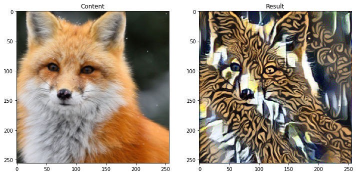

# Neural-Style-Transfer
Project for combined transfer of styles to an image (Pytorch implementation)

## Summary

Classic neural style transfer is an optimization technique used to take only <ins>two</ins> images — a content image and a style reference image — and blend them together. 
Using the code provided here you can <ins>combine</ins> different styles like below to modify the original image:

* You can use a mixture of styles:

* You can divide the picture using mask and apply different styles to each part:

See more examples in the notebook
Also you can combine these two concepts add more style and content images and playing with weight for each style using using the provided code.
